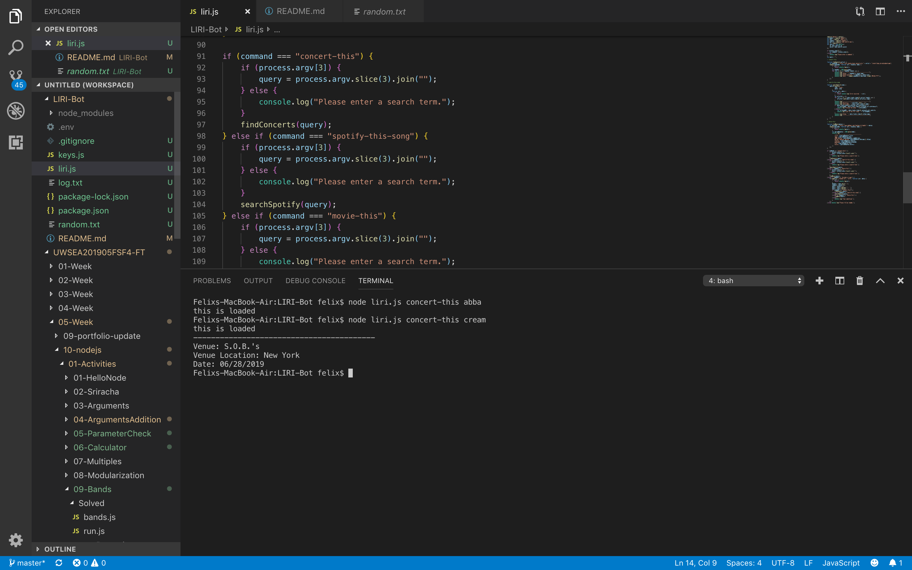

# LIRI-Bot

This LIRI-BOT app is able do the following:

Enter "node liri.js + `command` + <"what you want to search"> and let Liri do the work for you.
`command` includes :
- concert-this : get info regarding the band you type in
  1. Name of the Venue
  2. Venue Location
  3. Date of the Event
- spotify-this-song : get info regarding the song you type in
  1. Artist(s)
  2. The song's name
  3. A preview link 
  4. The album name
- movie-this : : get info regarding the song you type in
  1. Title of the movie
  2. Year 
  3. IMDB Rating 
  4. Rotten Tomatoes Rating 
  5. Country where the movie was produced.
  6. Language of the movie.
  7. Plot of the movie.
  8. Actors in the movie.
- do-what-it-says

## Usage

Visual Studio Code

## Resource & Helps

[Google](www.google.com)

[w3school](https://www.w3schools.com)

[stackoverflow](https://stackoverflow.com)

## Github link  

[GithubProfile](https://github.com/felix911104)

## Repo links

[LIRI-Bot](https://github.com/felix911104/LIRI-Bot)

## GoogleDrive Link to show the project 

- check out this shot video to see what the results will look like.
[GoogleDrive](https://drive.google.com/file/d/1WGw-KytBQqlG3YYp69ZjcI0X83mXFdsq/view)

## To use this app

In order to test this app,
you will need to have your own spotify key and install the npm packages list below.

1. [Node-Spotify-Api](https://www.npmjs.com/package/node-spotify-api)
2. [Axios](https://www.npmjs.com/package/axios)
- [OMDB](http://www.omdbapi.com)
- [BandsInTown-Api](http://www.artists.bandsintown.com/bandsintown-api)
3. [Moment](https://www.npmjs.com/package/moment)
4. [DotEnv](https://www.npmjs.com/package/dotenv)

## Screen shots

Here are some scrren shots of how the result will show.

## Author
Felix Zhang
